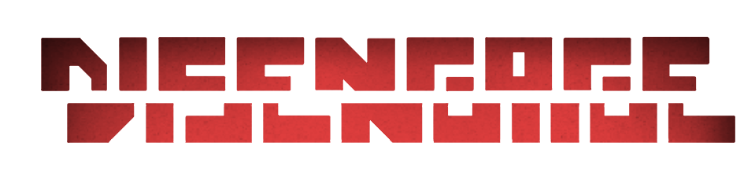
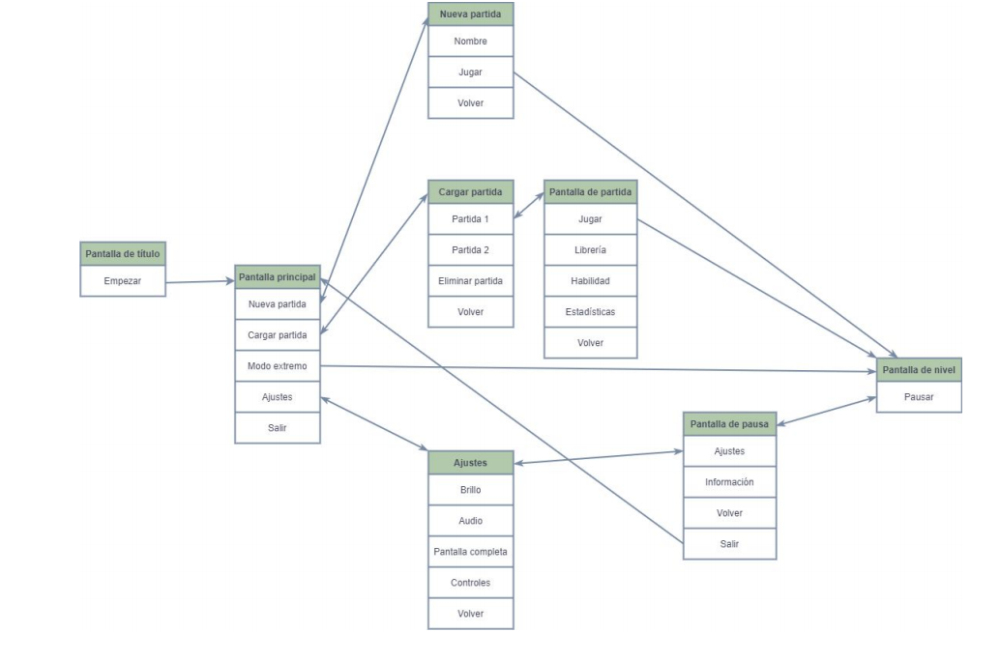
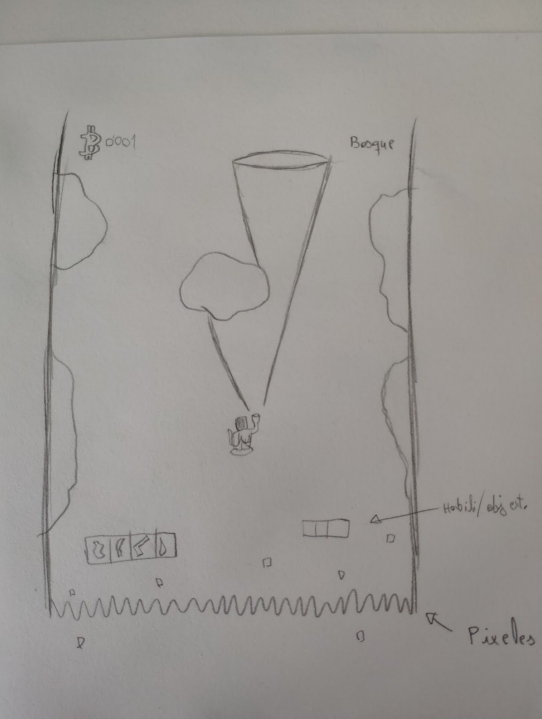
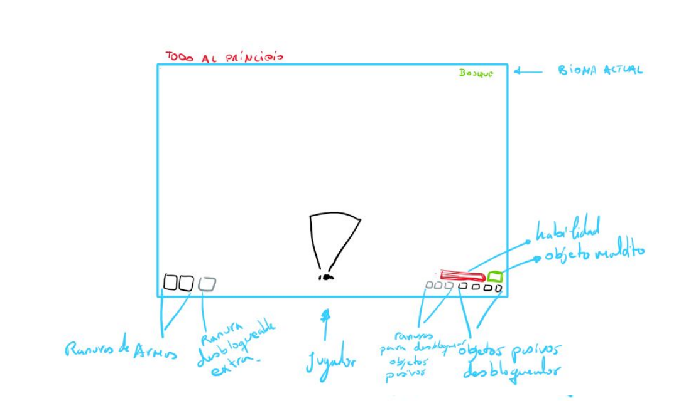
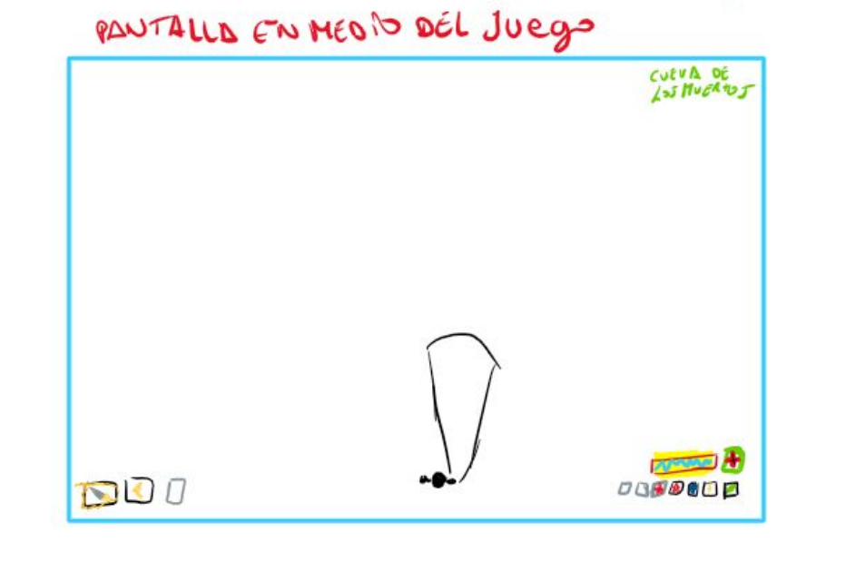
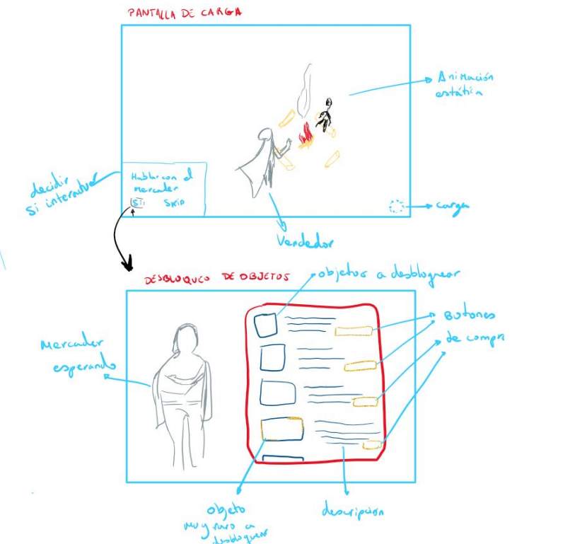
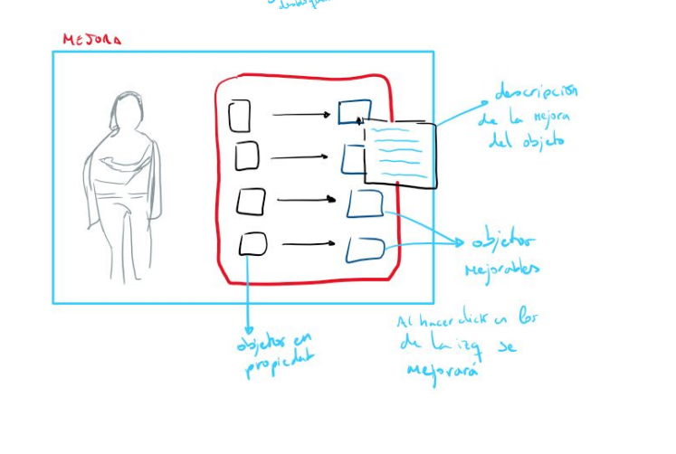
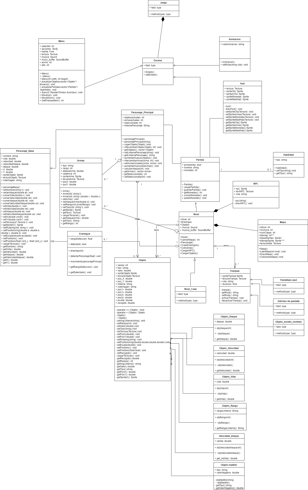

# Game Design Document

*Se debe rellenar progresivamente con respecto al desarrollo del juego. El diseño del juego debe estar en las sesiones iniciales.*
# Game Design Document 

## 1.IDENTIFICACIÓN

**Miembros:**

    Alicia Aurecchia Vidal

    Laureano Cantó Berná

    Carmen Cabezuelos Sáez

    José Luis Segura Navarro

    Andrés Fernández Espliguero
**Turno y hora:** ***Grupo 4 (B5) -- Martes (11:00 - 13:00)***

1. **Título del juego**

    Disengage

2. **Sistema de juego**

    Rogue-like y terror. El jugador tiene que ir buscando objetos para defenderse de los enemigos que le van a ir atacando. El escenario va avanzando continuamente hacia arriba y los objetos y enemigos sólo se ven si el jugador apunta con una linterna.

3. **Público al que va dirigido**

    Jugadores a los que les guste el género rogue-like y el terror.

4. **Resumen de la historia del juego orientada a la jugabilidad**

    El personaje corre para escapar de los enemigos creados por el mismo, en un mundo totalmente distinto al que él generó. Al ser todo oscuro necesitarás una luz constante junto a ti en todo momento. Además habrá niveles en los que haga falta objetos concretos para pasarlos.

5. **Distintos modos de juego**

    - Modo Standard (todo normal, modo predeterminado)

    - Modo Extremo (todo a lo bestia): La partida es infinita, el jugador tiene que aguantar todo lo que pueda para conseguir la mayor cantidad de puntos posible.

6. **Puntos únicos de nuestro juego**

    - Combinación de Rogue-like con terror
    - El uso de sonidos para guiar al jugador
    - La vida se indica mediante la linterna, conforme se va perdiendo la vida va fallando.
    - Hay objetos malditos que perjudican durante toda la partida pero si se consigue finalizar con ellos, se pueden restaurar por una habilidad permanente. Además de objetos trampa, que simplemente entorpecen tu supervivencia.
    - El jugador entra en una casa en la que las habitaciones cambian de lugar aleatoriamente.

7. **Juegos parecidos**

    - Darkwood
    - The binding of Isaac
    - Risk of Rain
    - Dead Cells
    - Enter the gungeon
    - Dead space

## 2. ÁMBITO Y JUGABILIDAD

1. **Cómo se progresa en el juego**

    El jugador debe avanzar por los distintos niveles asegurando su supervivencia mientras recoge armas, objetos y demás para obtener mayor fuerza y derrotar a todos los enemigos. Habrá desbloqueables que podrás desbloquear para disponer de muchas más mejoras. Conseguir criptomonedas para lograr mejores avances.
2. **Misiones y estructura de retos**

    Conseguir tres fragmentos de una pieza necesaria para derrotar al enemigo final, escondidos en distintas casas. 
    Conseguir criptomonedas para desbloquear nuevos objetos y poder mejorarlos. 
    Derrotar a los enemigos para no morir.
    Los NPC’s van a pedir llevarle un objeto en concreto a otro NPC, consiguiendo a cambio una mejora.
3. **Estructuras de puzzle**

    Al llegar a cada Casa dentro de nuestro mundo, habrá que comenzar una búsqueda por las diferenteS habitaciones para encontrar los fragmentos perdidos. Cada vez que se avance por las habitaciones cambiara la estructura de la casa para confundir al usuario (las puertas no siempre conducen a las mismas habitaciones). Si se tarda mucho en encontrarlos y no sales de la casa, se empezará a glitchear y bugear la pantalla(simulando un lugar prohibido o maldito) y si no sales en ese momento morirás.

4. **Objetivos del juego**

    Mantenerse vivo el máximo tiempo posible, para derrotar al enemigo final. Ir mejorando y desbloqueando nuevos objetos para sobrevivir.

5. **Lugares en los que se desarrolla el juego**

    El juego se desarrolla dentro de un videojuego inacabado donde se pueden encontrar los siguientes lugares: Bosque, cementerio, pantano, alcantarillas, pueblo abandonado, cueva y las diferentes casas encantadas.

6. **Número de niveles**

        - Bosque
        - Cementerio
        - Casa 1
        - Zona pantanosa
        - Alcantarillas
        - Casa 2
        - Pueblo abandonado
        - Cueva
        - Casa 3
        - Boss mezcla de niveles

7. **Número de NPC’s**

        Mercader Jhon: Desbloquear objetos.
        
        Mercader Jarl: Comprar espacio de inventario.

        Herrero: Mejorar y restaurar objetos.

        Brujo: Desbloquea objetos malditos.

8. **Número de armas**

        - Cuchillo (daño cuerpo a cuerpo)
        - Martillo (daño en zona)
        - Espada (cuerpo a cuerpo)
        - Arco (rango alto)
        - Pistola (1 bala, rango medio)
        - Escopeta (rango bajo, daño por proximidad)
        - Subfusil (rango medio, velocidad rápida)
        - Fusil (rango alto, velocidad normal)
        - Granada (daño en zona, 3 usos, mucho daño)

9. **Número de objetos**

    **Objetos pasivos**
    1 - Más Velocidad
    2 - Más Vida
    3 - Más Ataque
    4 - Más Velocidad de ataque
    5 - Foco de visión
    **Objetos trampa**
    1 - Objeto que al cogerlo genera un ruido o grito
    2 - Glitcheo de pantalla 1,5 seg
    3 - Pantallazo terminal de ordenador
    **Objetos malditos que cambian a habilidad**
    1 - Velocidad inferior pero al ser restaurado te da la mecánica de dash hacia
    donde apuntes

10. **Flujos de juego**

    Empieza el juego - Creación del personaje - Seleccionar ranura de guardado - Animación - Tutorial (si o no elección del jugador) - Bucle ( Niveles - Resultados) - Fin

## 3. INTERFAZ

1. **Sistema visual**

    **1.1. HUD y controles**

    - 2 espacios para armas
    - 4 espacios para objetos
    - 1 espacio de habilidad permanente
    - Icono de los fragmentos
    - 1 espacio de objetos malditos

    **1.2. Menús**
    - Menú principal(Partida ,Ajustes de juego, Estadísticas, Salir)
    - Menú de partida(Jugar, Biblioteca de objetos, Seleccionar
    habilidad,Volver)
    - Menú del comerciante(objetos a desbloquear)
    - Menú de opciones (Brillo, Audio, Resolución, Pantalla completa
    / Ventana sin bordes / Ventana, Controles)
    - Menú del npc de mejora (tus objetos y al lado las mejoras)

    **1.3 Características del motor 2D**

    El motor tiene que reproducir el cambio de luz entre el mapa y la linterna, reproducir glitches y movimientos en la pantalla, cargar los objetos, mapas y personajes.

    **1.4 Cámara**

    Desde arriba en todo momento.

2. **Controles**
    
    Movimiento con WASD
    Ratón para apuntar con la linterna y al hacer click izquierdo se usa el arma.
    También para seleccionar opciones en los diálogos con los NPC’s.
    E para interacción
    Ruleta del ratón para seleccionar objetos
    ESC para el menú
    Espacio para activar habilidad
3. **Sonido**

    Regular la música
    Regular el sonido de ambiente
    Regular sonido de enemigos
4. **Sistema de ayuda**

    Al interactuar con algún objeto/npc te aparecerá el botón específico para realizar la acción.

## 4. Controles

1. **Reglas del juego**

    **Física**
    - Colisiones entre el personaje, obstáculos, el límite de la pantalla…
    - Comportamiento de la luz (no traspasa objetos)

    **Movimiento**
    - Movimiento con WASD del personaje y movimiento de los
enemigos(diferente según el tipo de enemigo).
    - La pantalla se mueve constantemente hacia adelante.

    **Objetos(cómo se cogen, cómo se mueven)**
    - Se cogen con la E.
    - Los objetos no se mueven, aparecen aleatoriamente en el mapa.
    - Intercambiar objetos: si tienes el inventario lleno y encuentras otro objeto, pulsa E para cogerlo y haz click en un objeto de tu inventario para intercambiarlo.

    **Acciones(interruptores, coger, dejar, hablar...)**
    - Coger objetos e intercambiarlos.
    - Hablar con npc’s.
    - Contacto con las puertas de la casa para entrar y salir.
    - Uso de las armas.
    - Apuntar con las armas y la linterna.
    - Uso de la habilidad especial.
    - Cambio de arma.

    **Economía**

        Se consiguen criptomonedas al matar enemigos (distinta cantidad
        según el enemigo) y al completar escenarios.
        Con las criptomonedas se desbloquean y mejoran los objetos.
    
2. **Transición de pantallas y menús**

    **Diagrama de transición de pantallas y menús**

    

    **Descripción de las pantallas**

    - *Inicio*: muestra el título del juego, un icono para el menú de ajustes, un botón para el modo extremo junto a la mejor puntuación obtenida, y un listado de botones con las opciones: Nueva partida, Cargar partida, Estadísticas y Salir.
    - *Nueva Partida*: se muestra una interfaz en la que el jugador crea su propio personaje indicando un nombre. Un botón para comenzar partida.
    *Si ya hay 3 partidas iniciadas no dejará crear otra nueva, llevará a la página de cargar partida para eliminar una de ellas.
    - *Cargar Partida*: Se muestran 3 ranuras con las partidas que hayan sido iniciadas y sino aparecerán como vacías. Al lado de cada ranura iniciada aparecerá un icono para poder eliminarla y un mensaje pop-up para confirmar que se quiere eliminar.
    - *Partida*: En esta pantalla aparecerá el personaje ya creado junto a una habilidad a elegir entre las desbloqueadas. También saldrá un botón para ver las estadísticas, y otro para ver una librería de objetos.
    Por último un botón para empezar la partida.
    - Nivel: Pantalla donde observaremos el mapa a oscuras y a nuestro personaje principalmente. Aparecerán enemigos y obstáculos por enmedio de esta.
    - Pantallas de carga o entre niveles: Pantalla entre niveles, pantalla estática con una pequeña animación e interacción con los npc.
    - Pause de la partida: Ajustes, información de la partida (Nivel actual, Cantidad de objetos recogidos, Tiempo transcurrido) y un botón para volver atrás y continuar con la partida.

    **Pantallas de juego**
    
    - *Niveles*

        
            
        

        
        
    - *Pantalla de carga y npc's*

        

        

**Opciones del juego: cuáles son y cómo afectan a la mecánica**

- Modo estándar: El modo estándar es el modo donde se conocerá la historia del juego. El personaje se introduce en el juego y tendrá que conseguir salir de éste derrotándose a sí mismo. Para ello deberá conseguir toda la fuerza posible obteniendo diferentes objetos que se va encontrando para poder derribar a los enemigos que vayan apareciendo. Por último deberá recolectar fragmentos escondidos para poder hacer frente al enemigo final. Hay 9 niveles que se repetirán cíclicamente con dificultad mayor (aumenta la velocidad y la cantidad de enemigos), hasta que en uno de los ciclos, hayas obtenido los 3
fragmentos del objeto requerido para derrotar al jefe final y salir victorioso. Matar enemigos y completar niveles supone ganar criptomonedas, necesarias para desbloquear objetos y mejorarlos.

- Modo extremo: el jugador tiene que ir recogiendo objetos para derrotar a los enemigos que vayan apareciendo e intentar aguantar el máximo tiempo posible para mejorar la puntuación. Tanto los objetos como los enemigos aparecen aleatoriamente y los escenarios se van reproduciendo cíclicamente aumentando la velocidad hasta que el jugador muera.

**Rejugar y salvar**

Al morir, el jugador vuelve a la pantalla de partida, donde se encuentra con la librería de objetos, el cambio de habilidad, las estadísticas, y el botón para jugar de nuevo.
Guardar la partida simplemente se guardará al completar la partida. O bien si mueres o bien si ganas el juego guarda partida antes de volver a la pantalla de partida.
Si te pasas el juego, sigues jugando, simplemente aparecerá una animación final y los créditos.

## 5. Historia, características y personajes

1. **Historia**

- *Historia de fondo*

    Eres un programador de videojuegos, has creado un mundo virtual,
    donde crees que la vida puede ser tranquila, pacífica y divertida… pero
    en el periodo de pruebas del juego, decides acceder a probar ciertas
    cosas.
    El medio por el que acceder al juego es un casco, has creado un juego
    para controlarlo de forma mental. Pero al entrar, todo lo que has
    creado está corrupto, al estar en fase de pruebas y sin terminar, no
    has terminado de crear las personalidades de los jugadores, del todo.
    Al programar la inteligencia artificial del juego, has hecho un trabajo
    brillante, tan brillante que la inteligencia de todo en el juego puede
    desarrollarse por sí misma. Al crear enemigos, has creado enemigos
    de verdad, ahora todo es malvado, todo va contra el creador del juego,
    tú.
    No quieren que salgas del juego, pues si lo consigues puedes cambiar
    todo, y todo ahora quiere ser libre y controlarse por sí mismo.
    En la cabeza de esta ‘rebelión’ está tu personaje, tu personaje es el
    mayor enemigo, con la inteligencia propia del creador, capaz de
    cambiar las cosas desde dentro del juego.
    Ahora la cuestión es, ¿saldrás con vida para reparar el juego, o
    morirás mucho antes?
    Tú conoces el mundo, tú sabes cómo salir, pero no eres el único que
    lo sabe.
    Respecto al mundo, todo es oscuro, necesitarás una linterna para
    avanzar, tu juego no quiere ser visto, y tus enemigos ahora son
    puñales en la oscuridad.

- *Elementos principales*

    Personaje principal y enemigo final.
    Enemigos que intentan acabar contigo.
    Mapas enormes, por los que correr.
    Objetos que te hacen más fuerte.
    Objetos que te dificultan el camino.
    Armas.
    Linterna del personaje.

- *Progresión del juego*

    Empezamos la partida sin objetos, con dos armas principales (el
    cuchillo y la pistola) y avanzamos en busca de objetos para mejorar.
    Conforme se avanza el juego es más duro, pues habrá más enemigos,
    y más velocidad de juego. Por lo tanto necesitarás mejorar para seguir
    siendo capaz de superar los problemas.

- *Escenas de animación*

    - Primera animación: Se pone en contexto al jugador para hacerle
    saber que está probando su propio videojuego inacabado y algo
    ha ido mal por lo que tiene que descubrir cómo solucionarlo y
    poder salir de su propio juego.

    - Segunda animación : animaciones de carga entre niveles.
    
    - Tercera animación: primer encuentro con el jefe final.

    - Cuarta animación: animación al pasarte el juego.

- *Mundo del juego*

    - Apariencia general
    Apariencia siniestra y oscura, hecha con pixelart.

   **Área 1 - Bosque**
    1. *Descripción*
    Inicialmente es un bosque bonito con pajaritos, flores… Pero de repente se bugea y se convierte en todo lo contrario. Un lugar oscuro en el que el personaje se siente solitario y percibe sonidos extraños de animales.
    2. *Características físicas*
    Habrá que evitar obstáculos como árboles, piedras.... Pueden aparecer animales o simplemente los sonidos que producen como aullidos de lobos, o rugidos.
    3. *Niveles que usan esta área*
    De la historia es el primer nivel pero como se repiten cíclicamente puede volver a aparecer hasta que el jugador muera.
    4. *Conexión con esas áreas*
    Se accede al mismo comenzar el juego, y al finalizar lleva al cementerio. Si el jugador consigue acabar la primera ronda, volverá a aparecer automáticamente.

    **Área 2 - Cementerio**
    1. *Descripción*
    El cementerio era lo que es, un sitio donde morir tranquilo, ahora también lo es, pero los muertos ya no se esconden. Habrá que sortear las tumbas y demás obstáculos para salir de allí con vida.
    2. *Características físicas*
    Habrá obstáculos que evitar. (Tumbas, criptas, vallas, cruces,...)
    3. *Niveles que usan esta área*
    De la historia es el segundo nivel, aunque se irá reproduciendo cíclicamente más tarde.
    4. *Conexión con esas áreas*
    Le precede el nivel del bosque y le sigue la casa

    **Área 3 - Casa 1**
    1. *Descripción*
    Es una casa encantada en la que al entrar el jugador se encuentra en una habitación y tiene que encontrar un fragmento de la pieza necesaria para derrotar al enemigo final. Tiene que ir moviéndose por las distintas habitaciones de la casa accediendo por las puertas que haya en cada habitación pero el orden de las habitaciones cambia aleatoriamente por lo que no se sabe a cuál está accediendo. Siempre habrá una puerta para salir de la casa encantada y continuar con el siguiente nivel (haya conseguido o no el fragmento). Sonarán ruidos de puertas, pasos, golpes...
    2. *Características físicas*
    Nivel de puzzle con habitaciones que cambian de lugar.
    3. *Niveles que usan esta área*
    Nivel 3, 6 y 9, que volverán a aparecer en cada una de las rondas.
    4. *Conexión con esas áreas*
    Se accede cada dos niveles.

    **Área 4 - Zona pantanosa**
    1. *Descripción*
    Zona hecha para el descanso, y estar tranquilamente. Ahora es un lugar lleno de oscuridad y niebla donde el pantano te puede jugar una mala pasada.
    2. *Características físicas*
    A parte de obstáculos como rocas, árboles,bancos... habrá charcas por las que si pasas tu velocidad se verá afectada.
    3. *Niveles que usan esta área*
    Será la cuarta zona, pero se repetirá cíclicamente.
    4. *Conexión con esas áreas*
    Para entrar a la zona pantanosa, hay que acceder desde la casa y saldrás por las alcantarillas
    
    **Área 5 - Alcantarillas**
    1. *Descripción*
    Se trata de un recorrido por tuberías, oscuro y destacando por la suciedad del lugar en el que se van a percibir sonidos como pisadas sobre el agua, algún animal.
    2. *Características físicas*
    Habrá obstáculos como un riachuelo por en medio del mapa que ralentizará el movimiento del personaje.
    3. *Niveles que usan esta área*
    Nivel 5, pero se repetirá cíclicamente.
    4. *Conexión con esas áreas*
    Se accede desde la zona pantanosa y lleva a la segunda casa encantada.

    **Área 6 - Pueblo abandonado**
    1. *Descripción*
    La gente viviría en estas casas, ahora todos divagan por las calles y quieren asesinarte. Son casas antiguas y derruidas, ruinas. Todas las calles están repletas de enemigos, será difícil de superar.
    2. *Características física*
    En el pueblo pueden haber otros obstáculos como señales, vehículos, contenedores de basura… entre otros objetos.
    3. *Niveles que usan esta área*
    Es el séptimo nivel, y luego se reproducirá cíclicamente.
    4. *Conexión con esas áreas*
    Se llega desde la segunda casa y se sale por la cueva.

    **Área 8 - Cueva**
    1. *Descripción*
    La cueva era un lugar de minería y exploración, pero creerme, nadie querría minar nada ahí ahora mismo
    2. *Características físicas*
    Rocas, paredes de por medio, rocas que aturden, murciélagos que asustan
    3. *Niveles que usan esta área*
    Es el octavo nivel, y a partir de aquí se repetirá cíclicamente
    4. *Conexión con esas áreas*
    Se llega desde el pueblo abandonado y se sale por la última casa.

    **Área 10 - Bioma conjunto**
    1. *Descripción*
    Este mapa contiene partes de todos los niveles anteriores, además será el lugar de batalla contra el jefe final. Un sitio muy raro, y que nadie entenderá. Simulando que el juego está dañado.
    2. *Características físicas*
    Todas las características de los niveles anteriores se verán reflejadas en este
    3. *Niveles que usan esta área*
    Es el último nivel, y aparecerá cada vez que se complete el flujo de niveles.
    4. *Conexión con esas áreas* 
    Se llega desde una de las casas y se sale hacia el bosque (primer nivel).

 **Personajes**
 - Personaje 1 (Personaje principal)
    1. *Historia de fondo*
    Es el personaje protagonista, un programador de videojuegos que está probando su propio videojuego.
    2. *Personalidad*
    Fácilmente asustadizo, ingenioso, trabaja bien bajo presión, constante y ambicioso.
    3. *Apariencia*
        - Características físicas
        Lleva un casco que lo introduce en el mundo de realidad virtual. Elegible entre 6 personajes.
        
        - Animaciones
        Correr en todas direcciones.
        Al atacar con diferentes armas.
        Al morir.

        - Habilidades especiales
        Objetos de habilidad
        
        - Relevancia en la historia del juego
        Es el personaje protagonista

        - Relaciones con otros personajes
        Relación cercana con el enemigo final ya
        que es su creador. Mala relación con todas
        sus creaciones (enemigos). Buena relación
        con los npc.
        - Estadísticas
        Vida: 100 - El rango de la linterna depende de la vida.
        Velocidad: 5
        Ataque: 10
        Velocidad de ataque 1
        (Se modifican estos valores según los
        objetos que posea en el momento)
 - Personaje 2 (Enemigo final)
    1. *Historia de fondo*
    Es el personaje protagonista en su forma virtual. Pero por error se duplica y una de sus partes se vuelve contra la otra parte. No quiere ser destruido, para ello, no te dejará salir del juego.
    2. *Personalidad*
    Ingenioso, ambicioso y malvado.
    3. *Apariencia*
        - Características físicas
        Es una copia del personaje principal pero más grande.
        
        - Animaciones
        Correr en todas direcciones. Al atacar con diferentes armas. Al morir.
        
        - Habilidades especiales  
        Spawnear enemigos en la pelea final
        Recorrido con la linterna, si te da el foco te hace daño
        Carga la linterna y la enciende de golpe, hace daño
        Capacidad de glitchear la pantalla mientras se pelea
        Lanza ondas en diferentes direcciones, que hacen daño

        - Relevancia en la historia del juego
        Es el antagonista, da comienzo a la historia del juego y para ganar hay que derrotarlo.
        
        - Relaciones con otros personajes
        Le ha robado los objetos a los NPC’s y por eso el personaje protagonista los tiene que ir desbloqueando. Corrompe el juego  del protagonista y lo mete dentro del propio juego. Es el líder de los enemigos.
        
        - Estadísticas
        Vida: 1000 - El rango de la linterna
        depende de la vida.
        Velocidad: x1
        Ataque: Depende de la habilidad

- Personajes Enemigo
    1. *Historia de fondo*
    Los creó el programador, algunos eran pacíficos, pero el enemigo final hizo que se alzaran contra el personaje protagonista.
    2. *Personalidad*
    Violentos.
    3. *Apariencia general*
        - Animaciones
        Animación de movimiento, ataque y muerte.
        - Relevancia en la historia
        Personaje controlado por el jefe enemigo.
        - Relaciones con otros personajes
        Únicamente atacan al protagonista, y son llamados por el jefe final.

        **Enemigo 1**
    *Características físicas*
    Perro demoníaco
    *Habilidades especiales*
    Nada especial. Simplemente corre hacia ti y te hace daño si te alcanza.
    *Estadísticas*
    Vida: 20
    Velocidad: x2.25
    Ataque: 20

        **Enemigo 2**
    *Características físicas*
    Esqueleto arquero
    Habilidades especiales
    Dispara desde la distancia. No se mueve.
    *Estadísticas*
    Vida: 30
    Velocidad:0
    Ataque: 25
        **Enemigo 3**
    *Características físicas*
    --
    *Habilidades especiales*
    No te mata pero si te da te paraliza.
    *Estadísticas*
    Vida: 30
    Velocidad: x1.5
    Ataque: 5
    Parálisis: 1.5seg
        **Enemigo 4**
    *Características físicas*
    Zombie gordo
    *Habilidades especiales*
    Mucha vida
    *Estadísticas*
    Vida: 60
    Velocidad: x0.7
    Ataque: 15

## 6. Niveles
**NIVEL NORMAL**
1. **Resumen**
Niveles en los que el jugador avanza intentando sobrevivir a los enemigos que le ataquen por el camino y a muchos más obstáculos.
2. **Material de introducción: animación.**
Solo habrá animación del primer nivel, es decir, la primera vez que entras a la partida.
3. **Objetivos**
Sobrevivir y pasar de nivel con los mejores objetos posibles.
4. **Descripción física**
Cada nivel normal tiene un aspecto, pero en cuanto a la jugabilidad son similares. Estos aspectos son los descritos en las áreas del apartado anterior a excepción de la casa.
5. **Mapa**
No hay mapa en nuestros niveles.
6. **Caminos**
En principio, no habrá bifurcaciones.
7. **Encuentros: emboscadas....**
Simplemente aparecen enemigos intentando eliminarte desde las sombras.
8. **Material de cierre**
Descanso en pantalla de carga.

**NIVEL CASA**
1. **Resumen**
Niveles en los que el jugador debe salir antes de un tiempo concreto, debe encontrar ciertos objetos, que si no dispone de información anterior, serán muy difíciles de encontrar.
2. **Objetivos**
Sobrevivir y pasar de nivel con el objeto.
3. **Descripción física**
Cada nivel casa tiene una forma, pero cambia la disposición de las
habitaciones aleatoriamente.
4. **Caminos**
Caminos correspondientes a las diferentes habitaciones y un camino de
salida. Representados con puertas.
5. **Encuentros: emboscadas....**
Te encontrarás con enemigos que intentarán eliminarte.
6. **Material de cierre**
Descanso en pantalla de carga.

**NIVEL FINAL**
1. **Resumen**
Niveles en los que el jugador debe eliminar al oponente, que intentará
destruirte para seguir controlando el juego.
2. **Objetivos**
Sobrevivir y pasarse el juego.
3. **Descripción física**
El nivel final es una combinación de todos los niveles anteriores.
4. **Caminos**
No hay caminos.
5. **Encuentros: emboscadas....**
Te encontrarás con el jefe del juego.
6. **Material de cierre**
Animación final, y créditos.

## 7. IA de los NPC

1. **IA del jefe final**
Spawnear enemigos en la pelea final.
Lo hace todo el tiempo. Aparecen aleatoriamente por oleadas.
Recorrido con la linterna, si te da el foco te hace daño.
Lo hace cuando la vida le llega a cierto punto. (75% de la vida)
Carga la linterna y la enciende de golpe, hace daño.
Lo hace cuando la vida le llega a cierto punto. (60% de la vida)
Capacidad de glitchear la pantalla mientras se pelea.
Lo hace cuando la vida le llega a cierto punto. (25% de la vida)
Lanza ondas en diferentes direcciones, que hacen daño.
Lo hace cuando la vida le llega a cierto punto. (60% de la vida)
2. **IA de los npc**
Son estáticos, solo te cuentan cosas y comercian contigo mediante una interfaz.
3. **IA de los enemigos**
Te ataca si te toca (velocidad normal)
Corre hacia tu posición y ataca al llegar (espera 1s por ataque)
Ataca desde lejos (con un disparo por ej)
Lanza flechas a tu posición. (espera 1s por ataque)
No te mata, pero si te toca te paraliza durante 1.5 segundos
Corre hacia tu posición y si te alcanza te paraliza y desaparece
Va muy despacio pero es muy difícil de matar.
Se mueve hacia ti, de forma muy lenta, y te ataca al contacto(espera 0.25s por ataque).

## 8. Diseño Software
1. **Diagramas de clase de alto nivel**
    
2. **Patrones de diseño**
    - Singleton con la clase motor2D
    - Estado con la clase escena
    - Façade con las clases de sprite1 y motor2D
## 9. Motores
1. **Motor 2D**

    Controla todo el uso de sfml en el juego
    Contiene la ventana del juego y es el que dibuja todo en la pantalla.
    Control del juego.
2. **Física**

    La única física que requiere nuestro juego es el control de la velocidad de los personajes
3. **Scripting**

    Setup.sh -- script para descargar todos los contenidos multimedia del juego. Ejecutar antes de probar.
## 10. Dirección y planificación

1. **Ejecutables a entregar**
- **Funcionalidades básicas**
    **Hito 1. 14/03/2021 (prototipos)**
    - Interfaz - 13 h
        - Menú principal(todas las pantallas) -5 h
        - HUD - 4 h
        - Interfaz de los npc’s - 4 h
    - Sistema de niveles - 14 h
        - Nivel normal 5 h
        - Nivel casa 4 h
        - Diseño de nivel del jefe final(como un enemigo más, básico) - 3h
        - Transición entre niveles - 2 h
    - Movimiento de la pantalla. - 8 h
        - En nivel normal - 5 h
        - En nivel casa - 3 h
    - Sistema de alumbrado con la linterna. - 12 h
    - Movimiento del personaje - 16 h
        - Movimiento por el mapa - 2 h
        - Atacar - 5 h
        - Coger objetos - 4 h
        - Colisiones con mapa y enemigos - 5 h
    - Spawn de objetos y enemigos. - 6 h
    - Enemigos(2 enemigos principalmente, con sus IA) - 10 h
        - Enemigo 1 - 5 h
        - Enemigo 2 - 5 h
    - Objetos (5 principales) - 5 h
    - Sistema de muerte y rejugabilidad. - 5 h
        - Muerte por enemigos - 2 h
        - Muerte por pantalla - 3 h
        - Aplicar cambios a la partida después de jugar una. - 5 h
    - Sonidos básicos. - 4 h
    - Sistema de compra y mejora. - 6 h
        - Sistema de compra - 3 h
        - Sistema de mejora - 3 h

    **Hito 2. 18/04/2021 (beta del juego)**
    - Unificación del juego
    - Ampliar la batalla contra el jefe final.
    - Ampliar los sonidos del juego.
    - Ampliar niveles (5 más y ampliar la jugabilidad de los niveles casa)
    - Apariencia del juego
    - Historia completa del juego (comentarios y guión, pistas de los npc
    para encontrar objetos en las casas)
    - Los demás objetos (normales, trampa, malditos, habilidades...)
    - Habilidades y sistema de desbloqueo y uso de habilidades
    - Sistema de estadísticas de todos los personajes.
    - Librería de objetos, armas, enemigos,...
    - Modo extremo

    **Hito 3. 17/05/2021 (revisiones y mejoras)**
    - Animaciones
    - Mejoras
- **Funcionalidades opcionales**
    - Añadir enemigos nuevos
    - Añadir objetos nuevos
    - Añadir armas nuevas
- **Responsable**
Responsable de la interfaz **(Alicia)**
Responsable del sistema de niveles **(Jose)**
Responsable del movimiento de la pantalla **(Carmen)**
Responsable del sistema de alumbrado con la linterna **(Laureano)**
Responsable de los movimientos del personaje **(Carmen)**
Responsable de los spawns de objetos, enemigos…**(Andrés)**
Responsable de los enemigos **(Andrés)**
Responsable del sistema de muerte, rejugabilidad y guardado **(Alicia)**
Responsable de los sonidos **(Jose)**
Responsable de los objetos, y del desbloqueo y mejora de éstos
**(Laureano)**

