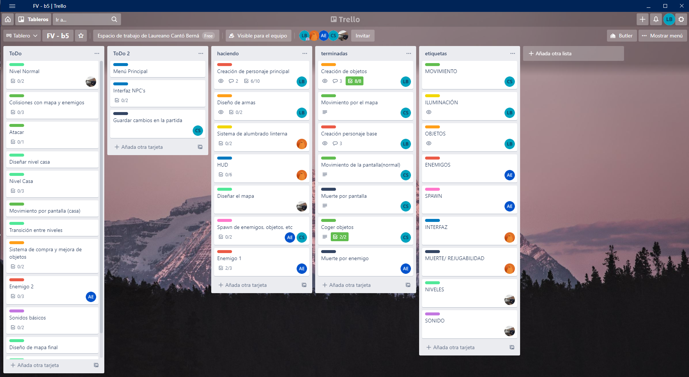
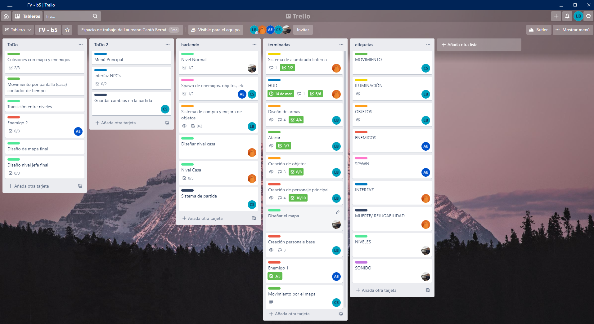
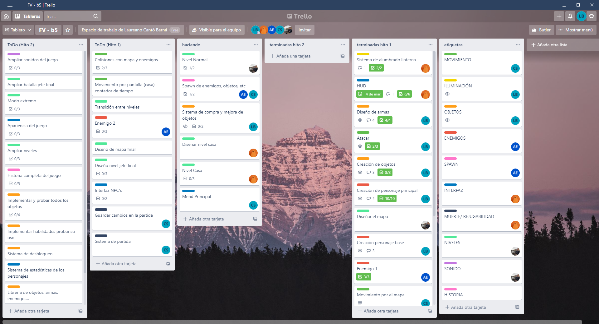
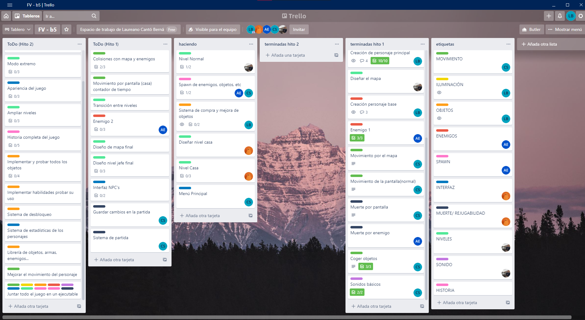
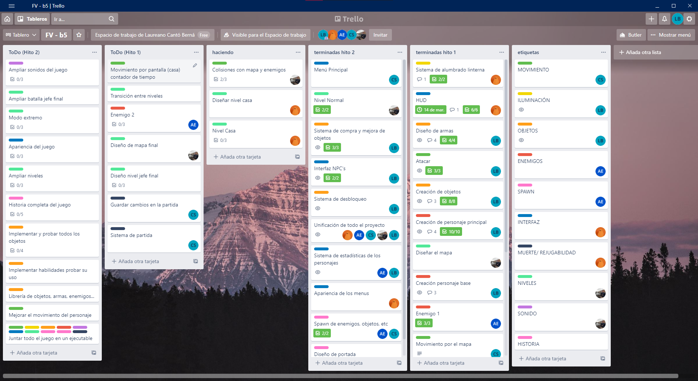
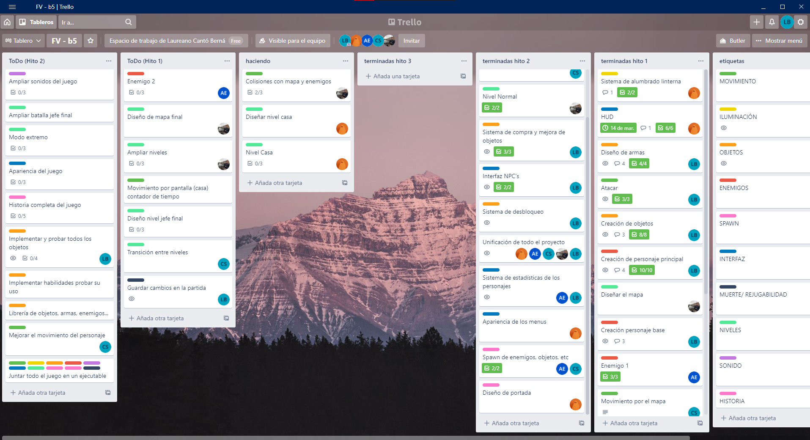
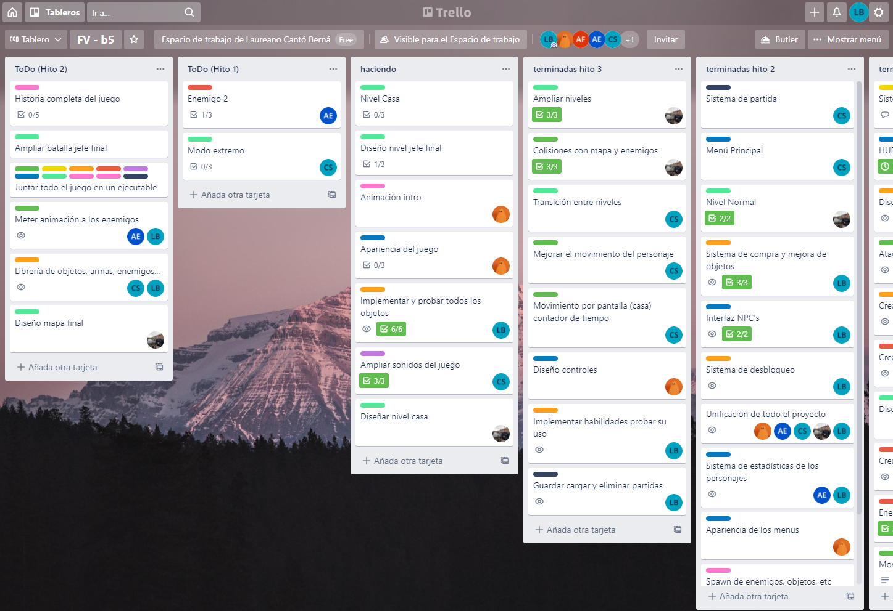
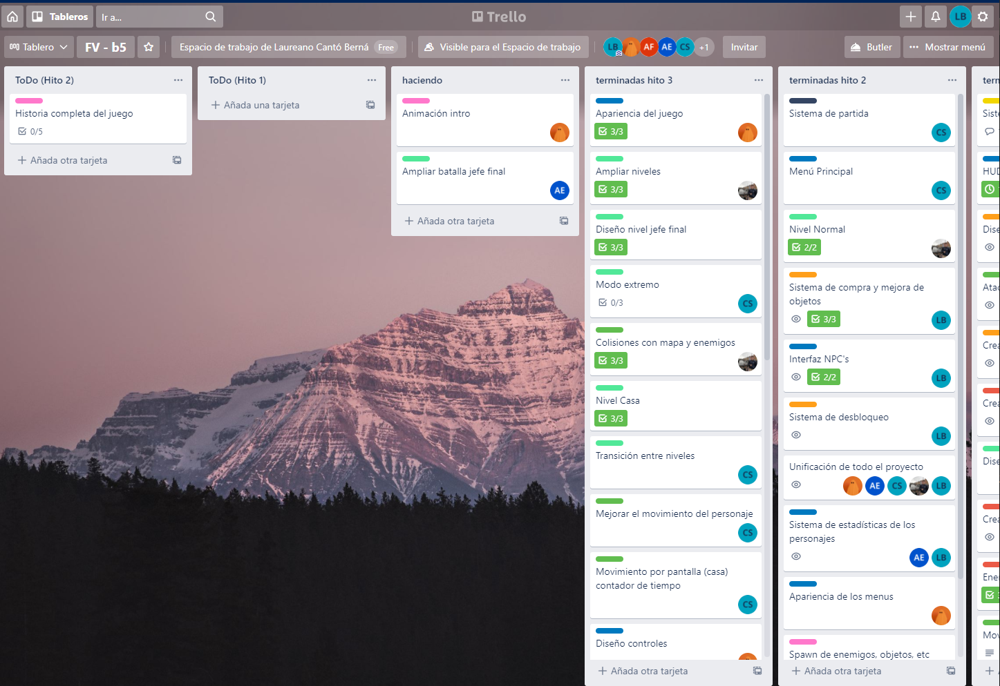
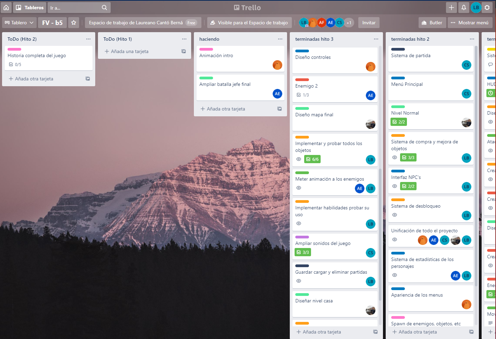
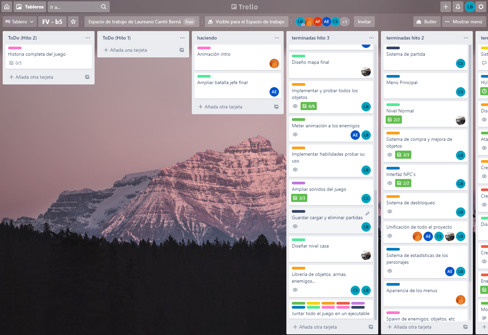

# Tareas Actuales

### Ejemplo:
`fecha_inicio; tarea; tiempo_dedicado; estado [nueva;en_progreso;fin]; usuario_git_encargado`
### Tareas:
#### Hito 1

#### Hito 2

#### Hito 3
 

# Otras cuestiones relacionadas
### Usamos trello : https://trello.com/invite/b/NQPqgiX7/dc8322d344d07a125cecfbd3f287c19c/fv-b5
