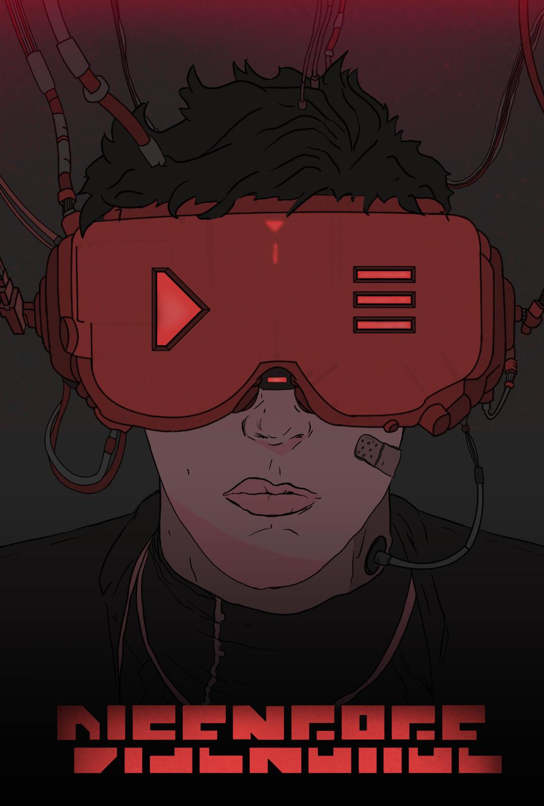

# Nombre del grupo
grupo-B5

# Componentes

## Cabezuelos, Carmen
* Cabezuelos, Carmen
* ccs74@alu.ua.es
* carmenccs74
## Cantó, Laureano
* Cantó, Laureano
* lcb40@alu.ua.es
* Laure-UA
## Segura, José Luis
* Segura, José Luis
* jlsn5@alu.ua.es
* jlsn5
## Fernández, Andrés
* Fernández, Andrés
* afe16@alu.ua.es
* afe16alu
## Aurecchia, Alicia 
* Aurecchia, Alicia
* aav61@alu.ua.es
* Alicia-UA

# Nombre del juego DISENGAGE
El personaje corre para escapar de los enemigos creados por el mismo, en un mundo totalmente distinto al que él generó. Al ser todo oscuro necesitarás una luz constante junto a ti en todo momento. Además habrá niveles en los que haga falta objetos concretos para pasarlos.

# Carátula del juego

# Comentarios sobre la práctica que se consideren oportunos
Tuvimos problemas para terminar el hito 2, pero con la llegada del último hito hemos avanzado a una gran velocidad y hemos terminado con casi todo lo que había previsto para los 3 hitos.